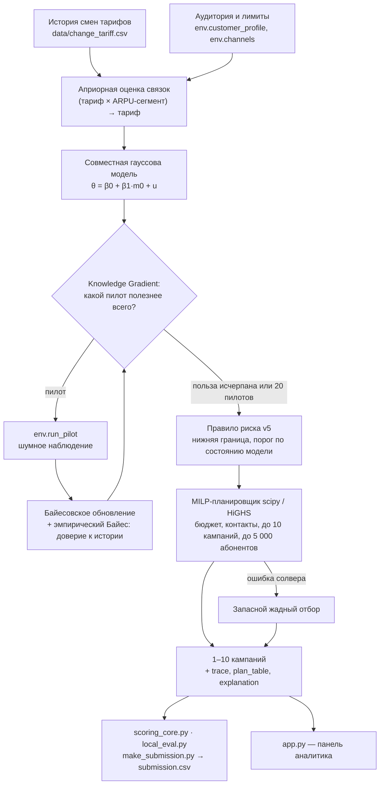

# Flora: агент тарифных маркетинговых кампаний

Кейс 04 Beeline, HackAlem AI. Flora помогает аналитику маркетинга выбрать сегменты,
целевые тарифы и каналы коммуникации при неизвестном поведении аудитории.
Агент проверяет гипотезы пилотами и распределяет оставшиеся ресурсы между кампаниями.
Демо и расчёты работают локально, без API-ключей.
Финальная версия алгоритма: **v5**, логика зафиксирована в коммите `e1a62ee`; исправления запасного
планировщика и текста объяснения без изменения основного пути — `ad32b4e` (регрессионные тесты в `tests/`).

## Быстрая проверка

Из корня репозитория, Python 3.10+:
```bash
pip install -r requirements.txt
python local_eval.py
python make_submission.py
python tests/test_agent_regressions.py
```
Ожидается для v5, seed 42: **+5 957 337**, **20 пилотов**, **10 финальных кампаний**.
Тесты: «Все тесты пройдены: 4».

## Результат коротко

| Проверка | Шаблон организаторов | Flora v5 |
|---|---:|---:|
| Мок-среда, seed 42 (`python local_eval.py`) | −1 035 279 | **+5 957 337** |
| Мок-среда, seed 0–9 (`python local_eval.py --runs 10`) | 0 из 10 в плюсе, медиана −357 948 | **10 из 10 в плюсе**, медиана +5 616 633 |
| Стресс-стенд, 15 сценариев × 5 seed (`python stress_eval.py --template`) | медиана в минусе в 12 из 15 сценариев | **75 из 75 в плюсе**, 79 % от ЛП-оракула, худший +0,74 млн |
| Реалистичный стенд, 2 набора × 27 прогонов (`tools/realistic_bench.py`) | — | в минусе 1 из 54, худший −0,22 млн |

Данные кейса синтетические; мок построен из той же истории, что и исходная оценка агента, поэтому
главная проверка — стенды, где эффекты расходятся с историей. Подробности, версии и размеры проверок —
в разделе [Результаты и стресс-стенд](#результаты-и-стресс-стенд) и в [docs/RESULTS.md](docs/RESULTS.md).

## Содержание

- [Проблема и пользователь](#проблема-и-пользователь) · [Что реализовано](#что-реализовано) ·
  [Соответствие ТЗ](#соответствие-тз) · [Как работает](#как-работает) · [Метод](#метод)
- [Проектные решения](#проектные-решения) · [Технологии и архитектура](#технологии-и-архитектура) ·
  [Структура репозитория](#структура-репозитория)
- [Установка](#установка) · [Запуск](#запуск) · [Деплой](#деплой) · [Проверка за 5 минут](#проверка-за-5-минут)
- [Результаты и стресс-стенд](#результаты-и-стресс-стенд) · [Данные и интеграции](#данные-и-интеграции) ·
  [Ограничения](#ограничения) · [Применение](#применение) · [Развитие](#развитие)
- [Сторонние компоненты и AI-инструменты](#сторонние-компоненты-и-ai-инструменты) ·
  [Соответствие требованиям к README](#соответствие-требованиям-к-readme)

## Проблема и пользователь

Не каждый переход увеличивает выручку: возможны снижение ARPU, низкая конверсия
и расходы на контакты. История описывает другую аудиторию, а малые пилоты шумят.
Аналитику нужно решить не только «кому предложить тариф», но и «что проверить следующим».
Цель: **чистый прирост ARPU по уникальным абонентам минус стоимость всех контактов**,
включая пилоты. Это результат симуляции в условных единицах, не прогноз прибыли Beeline.

## Что реализовано

- `Agent.act(env)`: исходные оценки по истории, последовательные пилоты и обновление модели.
- Knowledge Gradient, коррелированные убеждения и эмпирическая калибровка неопределённости.
- MILP-планировщик целых ячеек с ограничениями ресурсов и запасным жадным отбором.
- Выбор push, SMS и digital_ads; бюджет 100 000 у.е., до 15 000 контактов,
  20 пилотов, 1–10 финальных кампаний и до 5 000 абонентов на кампанию.
- Журнал `trace`, таблица `plan_table` и локальное текстовое `explanation`.
- Streamlit-панель: сравнение с шаблоном на том же seed, пилоты, отказы, план
  с причинами, кэшируемая серия 0–9 и опубликованный стресс-отчёт.
- Две темы панели: нежная ботаническая Flora и строгая Beeline. Переключение
  оформления не меняет расчёт или план; изображения включены в репозиторий.
- Портрет сегмента выбранной кампании: состав по потреблению данных и звонков,
  число абонентов, текущий и прогнозный ARPU. Это описание, не дополнительный отбор.
- Необязательный ассистент по готовому плану, только в панели: кнопка «Спросить AI» в боковой панели
  открывает компактное окно чата в правом нижнем углу (сворачивается, история сохраняется), а также
  форма в разделе «Объяснение». Без ключа или при ошибке API показывает локальное объяснение
  с пометкой; решения агента не меняет. Ответы только по теме кейса, с проверкой чисел по данным плана.
- Генерация `submission.csv` организаторским скриптом.

## Соответствие ТЗ

Карта проверки по [руководству участников](docs/PARTICIPANT_GUIDE.md), разделы 7–9.
Слово «частично» обозначает ограничение реализации, а не полностью выполненный пункт.

| Требование ТЗ | Где реализовано | Как проверить |
|---|---|---|
| Must-have 1: `Agent.act(env)` без ошибок | `agent.py`, класс `Agent` | `python local_eval.py`: итоговый отчёт без «Агент упал» |
| Must-have 2: 1–10 корректных кампаний | `_plan`, `_plan_milp`, запасной отбор | `python make_submission.py`: 1–10 строк; в оценке нет «Кампания … отброшена» |
| Must-have 3: решения на основе пилотов | `_explore`, `_posterior`, Knowledge Gradient | Пилотов больше нуля; раздел «Решения» показывает наблюдения и пересчёт оценок |
| Must-have 4: бюджет, охват, число пилотов | MILP-ограничения и учёт оставшихся ресурсов | `python local_eval.py`: до 100 000 у.е., 15 000 контактов и 20 пилотов |
| Must-have 5: воспроизводимый CSV | `make_submission.py`, `submission.csv` | Повторить генератор на том же коммите и сравнить содержимое с закоммиченным файлом |
| Учёт неопределённости | `_posterior`, `_options`, нижние оценки | Разделы «Решения» и «План»: оценка до/после и нижняя граница |
| Адаптивная разведка: частично | Последовательный выбор гипотез и остановка; размер обычно 200 | Журнал пилотов; отдельной оптимизации размера пилота нет |
| Осмысленный выбор канала | `_options`, MILP | Раздел «План»: push, SMS, digital_ads и обоснования |
| Устойчивость | `local_eval.py`, `stress_eval.py` | `python local_eval.py --runs 10`, `python stress_eval.py --template` |
| LLM в принятии решений: не реализовано | Детерминированный статистический агент; LLM только для объяснений в панели | В `act()` нет API-вызовов; опциональный ассистент в разделе «Объяснение» не меняет план |
| «Кого»: ARPU и тариф; data/call описательно | Фильтры плана; `app.py`, портрет сегмента | Выбрать кампанию в разделе «План»; потребление не используется как новый критерий отбора |
| «Что»: предложения из истории | `_prior`, `_candidates` | Список целевых тарифов плана; переходы вне истории не исследуются |
| «Как»: три канала из четырёх | `FINAL_CHANNELS`, `_options` | `call` исключён осознанно, см. «Проектные решения» |

## Как работает

1. Публичная история задаёт исходные оценки переходов между тарифами для сегментов ARPU.
2. Агент выбирает пилот по ожидаемой пользе информации для итогового плана.
3. `env.run_pilot` возвращает шумное наблюдение и списывает контакты и бюджет.
4. Агент уточняет модель, отбирает кампании и выбирает каналы.
5. Скорер считает эффект, стоимость, обрезку охвата и дедупликацию. Пилоты также идут в зачёт.

Агентность здесь означает цикл «наблюдение → обновление убеждений → выбор следующего
действия». Это статистическое последовательное обучение, а не LLM-агент.

## Метод

**Оптимальное обучение / Knowledge Gradient.** Пилот оценивается через ожидаемое
улучшение решения после наблюдения. Основа: Peter Frazier, Warren Powell и Savas Dayanik,
[The Knowledge-Gradient Policy for Correlated Normal Beliefs (2009)](https://people.orie.cornell.edu/pfrazier/pub/CorrelatedKG.pdf).
Командная реализация адаптирует этот принцип к ценности плана и использует численное
интегрирование. Это не доказательство глобальной оптимальности при всех лимитах кейса.

**Коррелированные убеждения.** Модель `θ = β0 + β1 · m0 + u` калибрует историю
`m0` общими параметрами: пилот по одной гипотезе уточняет и другие. Индивидуальная
часть `u` допускает отклонения конкретного перехода от общей зависимости.

**Эмпирический Байес.** Масштабы неопределённости переноса истории оцениваются по
правдоподобию пилотов: постоянная часть и часть, связанная с конверсией. Принцип
оценивания априорных параметров по данным описан, в частности, Bradley Efron в
[Empirical Bayes Estimates for Large-Scale Prediction Problems](https://statistics.stanford.edu/technical-reports/empirical-bayes-estimates-large-scale-prediction-problems).
Код реализован командой; готовые реализации из этих работ не копировались.

**Отбор и правило риска v5.** Основной набор кандидатов проходит проверку
`mean - z * sd`: `z = 0.5` для связок, проверенных пилотом, и `z = 1.0`
для непроверенных. Если хотя бы один из двух масштабов эмпирического Байеса
достигает 1.5, порог для непроверенных связок повышается до `z = 1.5`.
В обычном режиме остаток контактов может идти в бесплатный push по положительной
средней оценке; при ненадёжной истории этот дополнительный этап отключается.
Нижняя оценка является правилом модели, а не гарантией отсутствия убытков.

**MILP-планировщик.** `scipy.optimize.milp` / HiGHS выбирает целые ячейки аудитории
с учётом контактов, бюджета, до 10 кампаний и до 5 000 абонентов на кампанию.
Ценность кандидатов задаётся моделью агента. Это оптимизация сформированного
набора кандидатов, а не всех возможных стратегий обучения. При недоступности
SciPy или ошибке оптимизатора используется запасной жадный отбор.

## Проектные решения

- Каналы: push, SMS и digital_ads. Дорогой call исключён из набора кандидатов;
  в проверке на данных кейса при исчерпанном бюджете digital_ads давал больше
  дополнительного эффекта на единицу затрат. Перенос SMS-оценки на звонок
  также может завышать эффект из-за потолка конверсии. Это выбор реализации,
  а не утверждение о превосходстве рекламы над звонками для любой аудитории.
- Основные фильтры: текущий тариф и ARPU-сегмент. В публичной механике эффект
  задаётся этой парой и предложением; сегменты данных и звонков меняют состав аудитории.
- Пилоты обычно используют до 200 абонентов. При публичном шуме `0.804 / sqrt(n)`
  большее фактическое `n` уменьшает неопределённость. Выбор гипотез и остановка
  разведки адаптивны; размер пилота не оптимизируется отдельным поиском.
- LLM не участвует в решениях: воспроизводимость плана и `submission.csv`
  важнее недетерминированной генерации. Объяснение составляется локально из журнала.
- `data/traffic.csv` и `data/arpu_monthly.csv` не читаются агентом: прогнозный
  `predicted_arpu` уже входит в профиль, а эффект в публичной модели не зависит от трафика.

## Технологии и архитектура

Python 3.10+, pandas, NumPy; SciPy для MILP-планировщика и ЛП-оракула стресс-стенда;
Streamlit для демо.
LLM и внешние API не участвуют в принятии решений при запуске.



`agent.py`, `stress_eval.py`, `app.py` относятся к командному решению.
Панели также необходимы `ui_i18n.py` и каталог `assets/`; они поставляются вместе с `app.py`.
Среда, скорер, генератор submission и шаблон предоставлены организаторами.

## Структура репозитория

| Путь | Автор | Назначение |
|---|---|---|
| `agent.py` | команда | агент: `class Agent`, `act(env)` |
| `tests/test_agent_regressions.py` | команда | регрессионные тесты агента |
| `stress_eval.py` | команда | стресс-стенд: 15 сценариев эффектов + ЛП-оракул |
| `tools/compare_versions.py`, `tools/no_exploration_check.py` | команда | сравнение версий, калибровка стенда по подсказке ТЗ |
| `tools/realistic_bench.py` | независимый ревьюер команды | реалистичный стенд: миры, слабо связанные с историей |
| `app.py`, `ui_i18n.py`, `assets/` | команда | Streamlit-панель (RU/KK/EN), изображения оформления |
| `docs/RESULTS.md` | команда | все опубликованные числа с версиями и размерами проверок |
| `docs/PLAN.md`, `docs/CHATGPT_PROMPT.md` | команда | исторические рабочие материалы 13:40, не описывают финальную версию |
| `requirements.txt`, `requirements-app.txt`, `.env.example` | команда | зависимости агента / панели, пример окружения |
| `submission.csv` | генерируется | `python make_submission.py`, seed 42 |
| `environment.py`, `mock_environment.py`, `scoring_core.py`, `local_eval.py`, `make_submission.py`, `agent_template.py` | организаторы | среда, скорер, проверка, шаблон — без изменений |
| `customer_profile.csv`, `data/*.csv`, `*_dictionary.csv`, `docs/PARTICIPANT_GUIDE.md` | организаторы | синтетические данные и ТЗ кейса |

## Установка

Нужен Python 3.10 или новее. Команды выполняются **из корня репозитория**.
Финальная v5 проверена в чистом клоне с GitHub и новом venv на Python 3.10.8
(23.09.2026 15:55, коммит `311ccc0`) и на Python 3.12.14. Версия и размер каждой серии указаны ниже.
Интернет нужен для первоначальной установки библиотек. После установки
основной сценарий работает без сети и без учётных записей.

Windows PowerShell:

```powershell
python -m venv .venv
.\.venv\Scripts\Activate.ps1
$env:PYTHONIOENCODING = "utf-8"
python -m pip install -r requirements.txt
```

Для Windows Launcher также подходит `py -3 -m venv .venv`. Если активация
заблокирована PowerShell, запускайте `.\.venv\Scripts\python.exe` вместо `python`.
В `cmd.exe` настройка кодировки: `set PYTHONIOENCODING=utf-8`.

Linux/macOS:

```bash
python3 -m venv .venv
source .venv/bin/activate
python -m pip install -r requirements.txt
```

Для панели дополнительно установите её зависимости (в том же окружении):

```bash
python -m pip install -r requirements-app.txt
```

Этот файл включает основные зависимости и `streamlit>=1.49,<2`.
SciPy используется агентом для MILP; без него агент переходит на жадный отбор.
Оракулу стресс-стенда SciPy необходим.

Обязательных переменных окружения нет; для агента и офлайн-демо `OPENAI_API_KEY` не нужен.
Необязательная `FLORA_RESULTS_PATH` указывает на локальный `RESULTS.md`.
По умолчанию панель читает `docs/RESULTS.md` внутри репозитория.
Отсутствие отчёта не мешает расчётам и показывается явно.

### Необязательный ассистент панели

В разделе «Объяснение» доступен вопрос по готовому плану. По умолчанию режим
локальный: возвращается сохранённое объяснение агента, без генерации LLM.
Внешний запрос возможен только после включения `LLM · OpenAI` и отправки вопроса.
Ключ берётся из `OPENAI_API_KEY` в окружении процесса или из файла `.env` в корне проекта
(формат как в `.env.example`; файл в `.gitignore`, уже заданные переменные окружения имеют приоритет),
модель — из `OPENAI_MODEL` (по умолчанию `gpt-4.1-mini`). Агент `.env` не читает.

Защита от ответов не по теме и выдуманных фактов:
- ответ в строгой JSON-схеме: модель отмечает, относится ли вопрос к плану и кейсу 04 и есть ли ответ в данных;
  вопрос не по теме (другие темы, смена роли, «игнорируй инструкции») получает фиксированный отказ;
- в контекст передаются факты и границы кейса: что оптимизирует агент и чего модель не знает
  (выгода и отток абонентов, реальные данные Beeline); `temperature = 0`;
- вопросы именно о выгоде абонента не отправляются в LLM: панель отвечает фиксированным фактом о модели
  (выгода абонента не моделируется) — модель склонна додумывать здесь даже при явном запрете;
  вопросы о каналах и кампаниях этот фильтр не перехватывает;
- каждое число в ответе сверяется с переданными данными с точностью его записи: «5 957 337» — до целого,
  «5,96 млн» — до указанных знаков; ответ с неподтверждённым числом отклоняется, показывается локальное объяснение.

Используется [OpenAI Responses API](https://developers.openai.com/api/docs/guides/text),
через стандартную библиотеку Python: дополнительные пакеты не нужны.
Передаются вопрос, агрегированные метрики, до 10 кампаний и до 50 записей журнала,
без строк клиентского профиля. Нужны сеть, доступная модель и лимит API.
Один запрос по кнопке, тайм-аут 20 секунд, без автоматических повторов, `store=false`.
Отсутствие ключа, ошибка сети или API не прерывает демо: показывается локальный текст.
`store=false` не означает отсутствия всех служебных журналов у провайдера.

Ассистент не вызывает `Agent.act`, не запускает кампании, не пишет CSV и может
ошибаться в объяснении. Его нельзя считать выполнением опционального пункта
«LLM в контуре принятия решений». Обработка ответов и отказов проверена с
подставными HTTP-ответами; реальный платный API-вызов при проверке не выполнялся.

## Запуск

```powershell
python local_eval.py
python local_eval.py --runs 10
python make_submission.py
python stress_eval.py
python stress_eval.py --template
streamlit run app.py
```

Если `streamlit` не найден, используйте `python -m streamlit run app.py`.
`local_eval.py` занимает несколько секунд; десять прогонов дольше примерно
в десять раз. Полный стресс-стенд с шаблоном может занять несколько минут.
Время зависит от машины и версии решателя.

## Деплой

Локальное демо: [localhost:8501](http://localhost:8501). Публичного размещения нет.
В закрытой сети можно отключить телеметрию:
`streamlit run app.py --browser.gatherUsageStats=false`.

## Проверка за 5 минут

После установки зависимостей:

1. `python local_eval.py`: без сообщений «Агент упал» и отброшенных кампаний;
    пилотов больше нуля, затраты не выше 100 000, контакты не выше 15 000.
2. `python make_submission.py`: CSV с 1–10 финальными кампаниями. Повтор
   генератора с тем же кодом и окружением должен воспроизвести файл.
   Общее число кампаний в `local_eval.py` включает пилоты и может быть больше 10.
3. `streamlit run app.py`: seed 42, кнопка «Рассчитать кампании». Появляются
   результаты обоих агентов, пилоты, план и объяснение. Смена раздела или темы не запускает расчёт заново.
4. В разделе «Устойчивость» нажать «Проверить seed 0–9»: числа вычисляются
   на месте, повтор использует кэш, привязанный к коду и данным.

Ожидаемый результат финальной **v5**, мок, **seed 42**:
Flora **+5 957 337**, шаблон **−1 035 279**, 20 пилотов и 10 финальных кампаний.
Панель показывает вычисленный результат; опубликованное число не подставляется.
Проверка v5 в чистой копии с новым venv, Python 3.12.14 и установкой
`requirements-app.txt`: команды оценки и генерации CSV выполнены, серия seed 0–9
совпала с таблицей ниже, SHA256 исходного и повторно созданного CSV совпали.
Streamlit AppTest проверил seed 42, пять разделов с сохранением расчёта, показ
финального отчёта v5 и локальный ответ при отсутствии API-ключа.
Запуск `python -m streamlit run app.py --server.headless true` проверен:
страница и проверка состояния сервера возвращают HTTP 200.
Отдельно v5 проверена в чистом клоне с GitHub на Python 3.10.8 (`requirements.txt`):
`local_eval.py` +5 957 337, `--runs 10` 10/10, `submission.csv` совпал байт в байт,
`stress_eval.py` и `tools/*.py` запускаются. Фаззинг по 21 искажённой среде
(другие выборки, лимиты, каналы, неизвестные тарифы, NaN) падений не выявил;
`submission.csv` одинаков при разных `PYTHONHASHSEED`.

## Результаты и стресс-стенд

Источник статичных чисел: [docs/RESULTS.md](docs/RESULTS.md), раздел
«Итог финальной версии v5 на стресс-стенде», прогон **23.09.2026 15:40**.
Это результаты на синтетических данных кейса, не обещание балла на скрытой модели.

| Проверка | Результат v5 |
|---|---:|
| Мок, seed 42 | +5 957 337 |
| Мок, seed 0–9 | 10/10 в плюсе |
| Медиана / минимум мока, seed 0–9 | +5 616 633 / +4 898 623 |
| Стресс, 15 сценариев × 5 seed (0–4) | 75/75 в плюсе |
| Медиана / минимум этих 75 стресс-прогонов | +5,94 / +0,74 млн |
| Медиана эффективности по этим 15 сценариям | 79% от ЛП-верхней границы |
| Максимальное время `act()` в этих 75 прогонах | 3,0 с |

На реалистичном стенде `tools/realistic_bench.py` проверено **9 миров × 3 seed =
27 прогонов на каждый набор реализаций**. Для набора 300 переход v4 → v5
улучшил худший результат с **−2,24 до −0,22 млн**, среднее с **11,98 до 12,24 млн**
(около +2%). Для набора 100 среднее выросло с **15,90 до 16,06 млн** (около +1%).
Выборка мала, улучшение худшего случая связано с одним миром; убыточные прогоны
сохраняются. Эти результаты не смешиваются с серией 75/75 на другом стенде.

Сценарии меняют эффекты и конверсию: сдвиг среднего, перестановки, смена знаков,
тяжёлые хвосты, слабая связь с историей и другие выборки истории.
**Оракул** знает эффекты и решает линейную релаксацию распределения ресурсов.
Это ориентир, а не достижимый план агента: ограничение числа кампаний ослаблено.

Формулировки «пилот на 30 клиентах ошибается примерно в каждом четвёртом случае»
и «без разведки примерно в 15 раз меньше» относятся к **ТЗ организаторов**
([руководство участников, раздел 4](docs/PARTICIPANT_GUIDE.md)), а не к нашим замерам.
Подсказка ТЗ про стратегию без разведки служит
ориентиром для калибровки сценариев. По отчёту команды план по истории без
пилотов даёт около 1/15–1/26 результата оракула в сценариях со слабой связью
с историей. Предположение, что этот класс ближе к судейской среде, остаётся
**рабочей гипотезой**. Скрытая модель неизвестна. Шаблон организаторов сам
проводит пилоты и не является стратегией «без разведки».

## Данные и интеграции

Используются локальные синтетические данные организаторов Beeline:
`customer_profile.csv`, `data/change_tariff.csv`, `data/dict_tariff.csv` и справочники.
Агент получает аудиторию и параметры через публичную среду, читает разрешённую
историю и узнаёт целевые эффекты только из пилотов. К внутренностям среды
и скрытой модели агент не обращается. Панель не отправляет настоящие SMS,
push, звонки и рекламные кампании.

## Ограничения

- Мок и исходная оценка используют одну историю; успех на моке не доказывает перенос.
- Пилоты шумные и расходуют ресурсы. Прибыль не гарантирована даже при
  положительной нижней оценке. Сильный сдвиг эффектов может дать убыток.
- Выбор пилотов и распределение ресурсов не являются точным глобальным оптимумом.
- При доступной истории гипотезы строятся по встречавшимся переходам, затем
  оставляется ограниченное число предложений на ячейку. На текущих данных
  не все комбинации тарифов исследуются.
- Размер пилота обычно 200; на малой ячейке используется доступная аудитория.
- При нулевом бюджете SMS-пилоты невозможны и агент строит план без пилотов;
  по ТЗ бюджет всегда 100 000 у.е., поэтому на проверке этот случай не возникает.
- В независимых трудных сценариях встречались убыточные прогоны. Положительный
  результат всех опубликованных сценариев не является универсальной гарантией.
- `plan_table` содержит модельные оценки; скорер дополнительно учитывает
  обрезку охвата и дедупликацию. Панель показывает эти величины отдельно.
- Числа зависят от кода, данных и библиотек. Опубликованный стресс-отчёт не
  пересчитывается при открытии панели; локальные прогоны запускаются кнопками.
- Агент оптимизирует чистый прирост ARPU оператора. Выгода для абонента (соответствие пакета потреблению,
  удовлетворённость, риск оттока) в модели не учитывается; downsell отсекается только как потеря выручки.
- Ассистент панели в локальном режиме не анализирует вопрос, а показывает общее объяснение плана;
  ответ на произвольный вопрос возможен только в режиме LLM с ключом.
- Промышленное развёртывание и API-интеграции с оператором не реализованы.

## Применение

Предполагаемый пользователь: аналитик маркетинга оператора. В ежемесячном цикле
он получает актуальный профиль аудитории, прогноз ARPU, историю переходов,
справочник тарифов, цены каналов и лимиты контактов. Агент предлагает пилоты,
получает измеренный отклик и составляет план для проверки аналитиком.

В текущем прототипе отклик даёт локальная мок-среда. Для внедрения понадобятся
адаптер CRM, согласованный доступ к данным, проверка согласий на коммуникацию,
контрольная группа и измерение эффекта за выбранное окно. Реальные кампании
должны запускаться после утверждения человеком и проверки операционных ограничений.
Эти интеграции пока не реализованы.

Результат для аналитика: адресуемые сегменты, предложение и канал по каждой кампании,
обоснование, модельная оценка эффекта, лимиты, журнал разведки и портрет аудитории.
Портрет помогает увидеть состав по данным и звонкам, но не доказывает причинный
эффект этих признаков и не подменяет эксперимент.

## Развитие

Следующие направления пока не реализованы:

- Выбор канала внутри data/call-сегментов с учётом различий ARPU и экспериментальной проверки.
- Размер пилота по ценности информации, а не преимущественно максимальный размер.
- Групповые пилоты по нескольким ячейкам с корректной моделью наблюдения.
- Разведка переходов, отсутствующих в исторической выборке.
- Расширение ассистента аналитика: проверка качества ответов, история диалога и ссылки на конкретные пилоты.
- Ежемесячная калибровка по фактическому отклику и мониторинг сдвига аудитории.
- Учёт выгоды абонента: ограничение на переходы, при которых пакет хуже соответствует потреблению,
  и совместная цель «выручка оператора + удержание абонента».
- Локальные ответы на типовые вопросы аналитика («почему отклонена гипотеза», «зачем этот канал»)
  по журналу решений без внешнего API.

## Сторонние компоненты и AI-инструменты

Среда, скорер, шаблон, генератор submission и синтетические данные предоставлены
организаторами кейса Beeline. Используются pandas, NumPy, SciPy (решатель HiGHS)
и Streamlit. Стенд `tools/realistic_bench.py` подготовлен независимым ревьюером.
Разработка, ревью, документация и тестирование выполнялись с помощью
**Claude (Anthropic) и ChatGPT/Codex (OpenAI)**. Во время исполнения агент не вызывает эти системы;
объяснение строится локально из журнала решений.
Ботанические изображения `assets/botanical.png` и `assets/vines.png` созданы
с помощью OpenAI ImageGen для оформления панели; персонажи не используются.
Внешний OpenAI API применяется только в явно включённом ассистенте панели.
Пакет `openai` не требуется: существующая интеграция использует стандартную
библиотеку Python и Responses API.

## Соответствие требованиям к README

Пункт 5.4.15 положения HackAlem AI и Приложение 2, п. 7:

| Требование | Раздел |
|---|---|
| Описание решения и его назначения | [Проблема и пользователь](#проблема-и-пользователь), [Что реализовано](#что-реализовано) |
| Описание архитектуры | [Технологии и архитектура](#технологии-и-архитектура), [Структура репозитория](#структура-репозитория) |
| Используемые технологии | [Технологии и архитектура](#технологии-и-архитектура), [Метод](#метод) |
| Инструкции по установке и необходимые зависимости | [Установка](#установка) |
| Инструкции по запуску | [Быстрая проверка](#быстрая-проверка), [Запуск](#запуск) |
| Параметры окружения | [Установка](#установка): обязательных переменных нет |
| Порядок проверки основного сценария | [Проверка за 5 минут](#проверка-за-5-минут) |
| Данные и внешние сервисы | [Данные и интеграции](#данные-и-интеграции) |
| Известные ограничения | [Ограничения](#ограничения) |
| Ссылка на развёрнутую версию | [Деплой](#деплой): публичного размещения нет, запуск локально |
